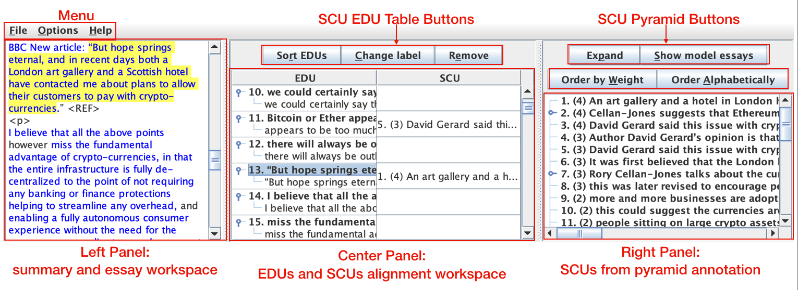

# SEAView

SEAView is a tool for annotating content in two-part essays, which contain a summary and an argument. This tool is used to annotate elementary discourse units (EDUs) from the argument section, and align them with semantically similar summary content units (SCUs) from the summary section. 

Please cite this paper if you use the tool:

Gao, Yanjun, et al. "Rubric Reliability and Annotation of Content and Argument in Source-Based Argument Essays." Proceedings of the Fourteenth Workshop on Innovative Use of NLP for Building Educational Applications. 2019.[Link](https://www.aclweb.org/anthology/W19-44#page=523)

## Interface example

## Requirements
Java 8 or higher.

## Features
Create and view SCU-EDU alignments, depicting semantically similar EDUs and SCUs in essays.  
Export SCU-EDU alignments in XML.

## How to use?
The annotation process has four main steps, designed to be performed using this tool and DUCView.
1. Annotate the wise crowd SCUs in DUCView.
2. Annotate the peer SCUs in DUCView.
3. Annotate the wise crowd EDUs in SEAView (SEA Annotation).
4. Annotate the peer EDUs in SEAView (SEP Annotation).

Steps 1-2 are completed independently of this tool. Step 3 requires a .pyr file from DUCView. SEAView will load the pyramid. Now you can begin annotating the wise crowd EDUs in SEAView. First, specify any necessary regular expressions in the Options menu. There are two:
- Document Header RegEx: Divides essays from each other.
- Summary Divider RegEx: Divides the summary from the argument in a single essay.
After specifying the regular expressions, add EDUs and SCUs to the table by dragging and dropping. 
#### To drag and drop an EDU:
- *Left click* to highlight text on the left pane.
- *Right click* to drag into the table.
#### To drag and drop an SCU:
- *Left click* an SCU to highlight it on the right pane
- *Left click* to drag into the table.
#### To view the SCU-EDU Alignment:
- Select File > SEA Annotation (or SEP Annotation) > Show SCU-EDU Alignment
#### Table functions:
- Sort: sort the table by the order in which the EDUs occurred in the text
- Change label: change the label of an EDU/SCU
- Remove: remove an EDU or SCU from the table, or remove a contributor from an EDU
#### Pyramid functions:
- Show model essays: when creating an SEP annotation the model essays can be viewed
- Expand/collapse the pyramid
- Order by number of contributors or alphabetical order

Finally, Step 4 is completed using a .pan file from DUCView, and is performed analogously to Step 3 for the peer EDUs.

## Class documentation
This section contains an overview of the most important classes in the project and their functions.  

#### SEAView
- Contains the main function
- Is primarily responsible for creating the GUI using Swing
- Handles parsing and writing of XML files
- Creates and views the SCU-EDU alignment table
#### SEATable
- The main table in SEAView
- Shows aligned EDUs and SCUs
- Provides functions for interacting with the table, such as drag and drop support and sorting
#### SCU
- Defines an SCU/EDU with an ID, label, and a comment
#### SCUContributor
- Defines an SCU/EDU contributor - a portion of the text from a summary that makes up an SCU
- Includes a list of the contributor's SCUContributorParts, which may be non-adjacent in the text
#### SCUContributorPart
- Defines a part of an SCU/EDU contributor
- Includes the starting and ending indices of the SCU/EDU contributor in the essay, as well as the text
#### SEAViewTextPane
- Defines the left pane of SEAView, containing the essay text
- Includes functions for displaying, highlighting, and selecting text
#### SCUTree
- Defines a tree for SCUs/EDUs
- Used to display the pyramid and the EDUs in the table
- Includes various functions for interacting with SCUs/EDUs such as highlighting and drag and drop
#### EssayAndSummaryNum
- Simple class that contains a pair of values indicating where text came from
- Primarily used by the SEATable class to determine whether an EDU is valid, based on whether it came from a summary or an argument, and whether it comes from the right essay number
